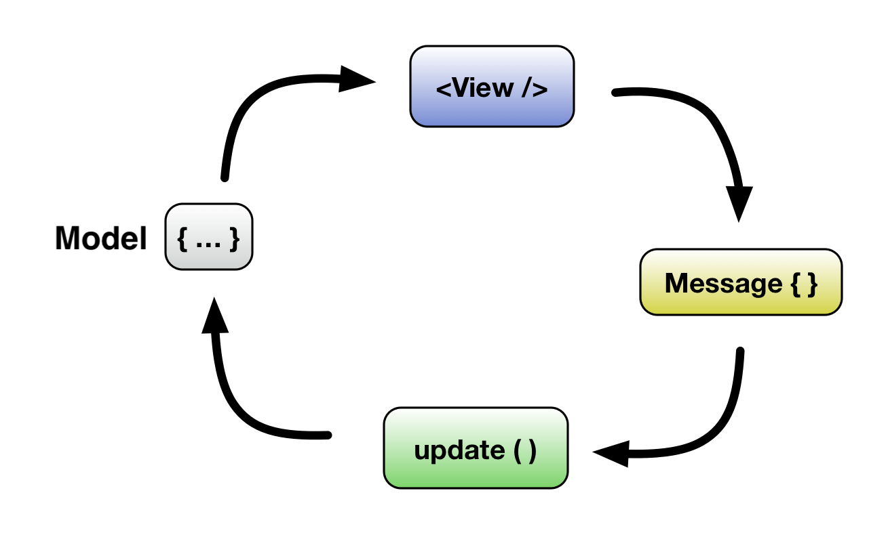
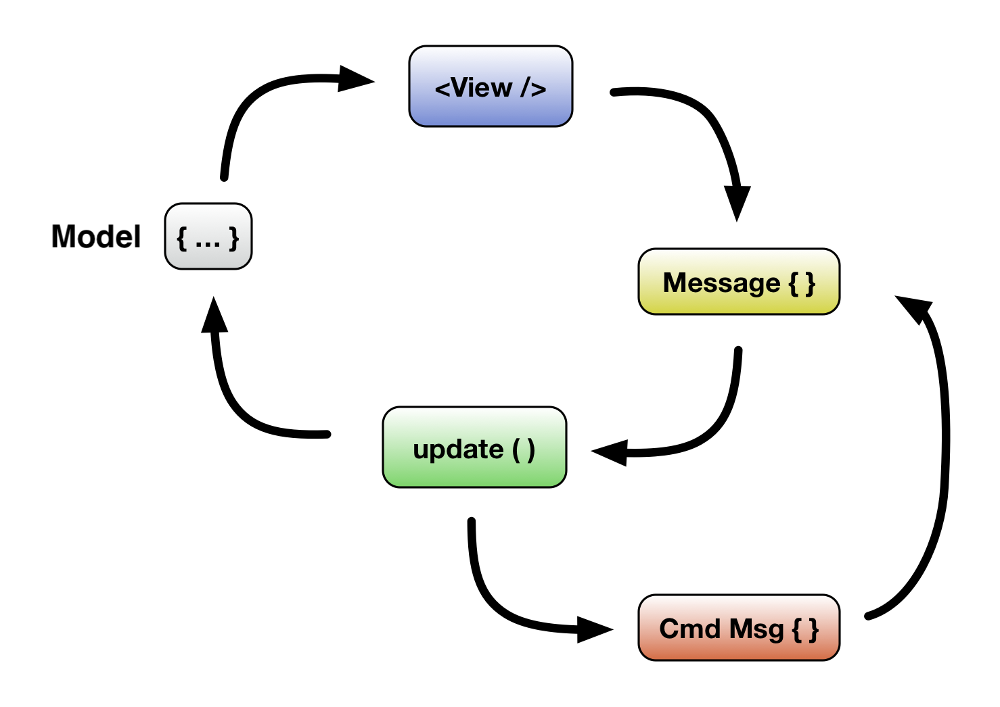

# Casium: An application architecture for React

The Axiom Front-End Architecture is a _data_ and _effects_ management system that helps you manage the complexity of large React applications reliabily and predictably.

It does this by modeling the state of your application (yes, all of it) as a single, immutable value, and handling side-effects in application logic with _messages_. If this reminds you of [Redux](http://redux.js.org/), that might be because both are derived from [The Elm Architecture](https://guide.elm-lang.org/architecture/). However, this library attempts to hew more closely to Elm's design in order to gain [more of Elm's advantages](https://www.youtube.com/watch?v=XsNk5aOpqUc&t=16m24s), and to provide a better, more cohesive developer experience.

## Application structure

Applications implemented on the architecture are organized into two different types of React components:

 - **Views** (or view components), which are implemented as [pure functions](https://www.reactenlightenment.com/react-state/8.4.html)
 - **Containers** (or container components), which are implemented using a builder function exported by the architecture

In other words...

```javascript
class Never extends Component { /* 😉 */ }
```

## The counter example

The basic implementation of a container looks like this:

```javascript
import React from 'react';

import Message from 'architecture/message';
import { container } from 'architecture/app';

class Increment extends Message {}
class Decrement extends Message {}

export default container({

  init: () => ({ count: 0 }),

  update: [
    [Increment, ({ count }) => ({ count: count + 1 })],
    [Decrement, ({ count }) => ({ count: count - 1 })]
  ],

  view: ({ emit, count }) => (
    <div>
     <button onClick={emit(Decrement)}> - </button>
     { count }
     <button onClick={emit(Increment)}> + </button>
    </div>
  )
})
```

Containers are composed primarily of 3 things:

 - **`init`**: A function that returns the container's initial state. This is called when the container is first instantiated, and should set up the default values for all state properties to be used in the container. This should be a plain JavaScript `Object`. (This function will sometimes take a parameter if state is being delegated to it from higher up — we'll get to that later). In general, containers shouldn't have to check whether values exist. If they do, you should probably update your `init` function.
 - **`update`**: A [`Map`](https://developer.mozilla.org/en-US/docs/Web/JavaScript/Reference/Global_Objects/Map) that pairs _messages_ to _update handlers_ (or _updaters_). This is where the action happens. All changes to the application, whether state changes or side-effects (like HTTP calls) happen via _messages_. This allows the entire state and lifecycle of the application to decompose to simple data structures. Containers intercept messages, and call the updater for that message with the current state as a parameter. The updater returns the new state. Finally, the container re-renders the view with the new state.
 - **`view`**: The view is a stateless React component that receives the container's current state as its props (as well as any other props passed to the container by React). In addition to the state, it also receives one special value, **`emit`**, which is a function that accepts a message and gets assigned to an event handler. This is what allows the container to be notified about events that we care about and respond with the appropriate updater.

### Messages

You may have also noticed the `Increment` and `Decrement` classes up at the top that extend `Message`. As you probably guessed, those are the _messages_ referenced in the explanation above. Messages are a powerful abstraction, but right now we're just using them to link an event handler to an update we want to apply.

## Messages with data

In our initial example, we completed the cycle of...

 1. Setting up the component with an initial state
 1. Rendering the component with the initial state
 1. Receiving messages from the view
 1. Handling the messages in `update`
 1. Updating the state
 1. Re-rendering the view
 1. Go to (3)

It looks a bit like this...



This is a good start, but it's somewhat limiting. What if we need to step our counter by 100, or 1000? That's a lot of clicking. We could create up/down messages & buttons for powers of 10, but that's a lot of boilerplate.

Instead, we can turn our counter display into an `<input />` to allow users to type in arbitrary values, and wire our input up to the container with a new message:

```javascript
class Increment extends Message {}
class Decrement extends Message {}
class SetCounter extends Message {} // <-- New thing

export default container({

  init: () => ({ count: 0 }),

  update: new [
    [Increment, ({ count }) => ({ count: count + 1 })],
    [Decrement, ({ count }) => ({ count: count - 1 })],
    [SetCounter, (state, { value }) => ({ count: parseInt(value, 10) })]
  ],

  view: ({ emit, count }) => (
    <div>
      <button onClick={emit(Decrement)}> - </button>

      <input
        type="number"
        value={count}
        onChange={emit(SetCounter)}
      />

      <button onClick={emit(Increment)}> + </button>
    </div>
  )
})
```

We've created a new message, `SetCounter`, to handle our new event.  You'll also notice that the updater for `SetCounter` looks a bit different from the ones before. In addition to being typed objects, messages hold _data_, either from the view, or from _commands_ (we'll get to that later). In the previous examples, our messages didn't use any data — we just took in the existing state (destructured it), and returned a new state.

Updaters receive message data as their second parameter, and we can [destructure](http://2ality.com/2015/01/es6-destructuring.html) the part we care about, use it to calculate a new state object, and return it.

By default, messages emitted from DOM events will have `value` and `checked` properties, which will match the properties of the element emitting the event, for convenience purposes.


### Parameterizing messages

Suppose all that typing is just too much, and we decide we _did_ want buttons to step our counter by larger increments. We can add parameters to our messages directly in the view, and refactor our existing updaters to accomodate them.

First, we'll add _default values_ to our messages:

```javascript
class Increment extends Message {
  static defaults = { step: 1 }
}
class Decrement extends Message {
  static defaults = { step: 1 }
}
```

This means that these messages will always pass a `step` value to their update handlers: either one provided by the view, or the default value of 1. Next, we'll override the default `step` value in the view, by adding a new pair of buttons:

```javascript
export default container({

  // ...

  view: ({ emit, count }) => (
    <div>
      <button onClick={emit([Decrement, { step: 10 }])}> -- </button>
      <button onClick={emit(Decrement)}> - </button>

      <input
        type="number"
        value={count}
        onChange={emit(SetCounter)}
      />

      <button onClick={emit(Increment)}> + </button>
      <button onClick={emit([Increment, { step: 10 }])}> ++ </button>
    </div>
  )
})
```

We can see in the new `++` and `--` buttons that the format for calling `emit()` has changed: instead of just passing a message class, we're now passing an array with a message class and an object with some values. These values will be merged with any other data received from the view when constructing the message.

Finally, we need to close the loop and modify our update handlers to accept the `step` value. As above, updaters receive message data as their second parameter. Since we only care about `step`, we'll destructure it directly:

```javascript
export default container({

  // ...

  update: [
    [Increment, ({ count }, { step }) => ({ count: count + step })],
    [Decrement, ({ count }, { step }) => ( count: count - step })],
    [SetCounter, (state, { value }) => ({ count: parseInt(value, 10) })]
  ],

  // ...
})
```

Now the counter is updating according to `step`, and we can reuse the same message in different contexts by parameterizing it appropriately. Next we'll look at how we can leverage and extend messages to encapsulate business logic and reduce updater boilerplate.

## Actually doing stuff (aka 'effects')

So far we've looked at managing and rendering data within an application. That's a good start, but in order to do something useful, we need to step outside our cozy, stable world of immutable data and interact with very mutable, unstable things. Things like servers, and browser services like cookies and local storage.

These interactions are called _side-effects_, and side effects trip us up because they break our guarantees about the state of our application. Up till now, we've been able to model the state of our application with a very simple equation: `current = initial + (messages...)` — in other words, each state is the sum of the state before it, plus the most recent message, going all the way back to the initial state.

### Lifestyles of the rich and the stateless

Think of it like a bank ledger: the current balance is just a sum of all the transactions. However, when we introduce side-effects, our bank balance starts changing out from under us. We no longer have an audit log of what it should be or why. We have no way to predict it, and we've lost the ability to reproduce it or examine it in an isolated context.

So, how do we make our state predictable again? With more messages, of course!

Up until now, we've been both producing (in the view) and consuming (in the update) our own messages. _Command messages_ (or just _commands_) are a new type of message: we produce them, but they're consumed by the architecture, in the background, away from our application code. The architecture _manages_ our effects for us. We use these commands any time we want to read, write, or execute something outside of our state, like HTTP calls, cookies, etc.

As with state modifications, commands are returned by update handlers. This allows our update handlers to be [pure, stateless, side-effect-free functions](https://softwareengineering.stackexchange.com/questions/254304/what-is-referential-transparency): they always return the same value for the given inputs.

Further, they don't _do_ things: the simply return values that _represent_ doing things. Let's test-drive this by implementing a button to save the counter to local storage. We'll start by importing the necessary commands. The architecture comes pre-packaged with commands for most common operations.

We can import and use these commands to tell the architecture what effects we want, and the architecture will handle them for us:

```javascript
import { LocalStorage } from 'architecture/commands';
```

This imports a module object with a few different classes for our consumption.

Next, we'll implement a button to trigger our save, with a new `SaveCounter` message, and add a placeholder update handler where we'll eventually put our new command:

```javascript
// ...
class SaveCounter extends Message {}

export default container({
  // ...

  update: [
    // ...
    [SaveCounter, (state) => [state]]
  ],

  view: ({ emit, count }) => (
    <div>
      // ...
      <button onClick={emit(SaveCounter)}>Save</button>
    </div>
  )
})
```

This doesn't do anything yet (except render a new button), but we can already see that something with the update handler is a little different: we're still returning the state, but now it's inside an array. This gives us a place to put our commands, since we'll be returning two things instead of one. Let's add that second thing now:

```javascript
// ...
export default container({
  // ...

  update: [
    // ...
    [SaveCounter, (state) => [state, new LocalStorage.Write({
      key: 'counter',
      value: state.count
    })]]
  ],

  // ...
})
```

Here, we're returning a new instance of the `LocalStorage.Write` command message, and giving it a `key` and a `value`, which tells local storage what to write.

This is all well and good for fire-and-forget operations like writing to local storage, but what about _reading_? What about commands that do things where we care about the result?

We handle this by giving the command a _result message_. These are normal messages that we implement and handle ourselves, just like the ones emitted from the view. We pass one of these messages to the command in a `result` key, and the architecture will send that message back to our view when the command has executed.

This extends the cycle of our data flow like so:



In addition to the primary cycle of messages and state changes (and rendering, etc.), we now have a secondary cycle where updaters _also_ return commands (in addition to updating state), which send messages back to an updater.

This style might feel weird if you're used to using promises or callbacks. Promises and callbacks make it easy to do long chains of deeply-nested behaviors, that can be tough to decompose when debugging, testing, or refactoring.

This approach lets us flatten out those chains, letting us handle one logical update at a time, in isolation from others.

Let's try loading the counter back from local storage when the container initializes. Because we don't want to touch local storage directly, we'll have `init()` kick off a command that will be immediately handled and returned to the container in the form our `result` message (which we'll define below as `LoadCounter`).

The expected return value format for the `init()` function is actually the same as for update handlers, so we can implement this just by changing what it returns:

```javascript
// ...
class LoadCounter extends Message {}

export default container({

  init: () => [{ count: 0 }, new LocalStorage.Read({
    key: 'counter',
    result: LoadCounter
  })],

  update: [
    [LoadCounter, (state, { value }) => ({ count: value })],
    // ...
  ],

  // ...
})
```

**@TODO**: Sidebar explanation on different return formats.

Again, we're changing the return value of `init()` to the array format we saw before, so that we have a way to return both our initial state _and_ the command. We construct our `Read` message with the `key` we want to read, and `result`, which is the message that will be sent back to the container with, you guessed it: the result. This is symmetrical to the `Write` command, except that the `key` and the `value` are spread across the command and result message, respectively.

We handle our `LoadCounter` message, destructuring the `value` property and assigning it to the `count` property of our new state. Great, right?

Well, almost. Don't look now, but we've just introduced an error into our app: `count` is supposed to be a number, but local storage returns strings. We need to pass `value` through `parseInt()` and... this is starting to look a lot like work we've already done. 

Instead, we can reuse our existing `SetCounter` message — both messages expect to have a `value` which gets number-ified and written to the `count` property of the state.

Altogether, our app should look something like this:

```javascript
import React from 'react';

import Message from 'architecture/message';
import { container } from 'architecture/app';
import { LocalStorage } from 'architecture/commands';

class Increment extends Message { static defaults = { step: 1 } }
class Decrement extends Message { static defaults = { step: 1 } }
class SetCounter extends Message {}

export default container({

  init: () => [{ count: 0 }, new LocalStorage.Read({
    key: 'counter',
    result: SetCounter
  })],

  update: [
    [Increment, ({ count }, { step }) => ({ count: count + step })],
    [Decrement, ({ count }, { step }) => ( count: count - step })],
    [SetCounter, (state, { value }) => ({ count: parseInt(value, 10) })],
    [SaveCounter, (state) => [state, new LocalStorage.Write({
      key: 'counter',
      value: state.count
    })]]
  ],

  view: ({ emit, count }) => (
    <div>
      <button onClick={emit([Decrement, { step: 10 }])}> -- </button>
      <button onClick={emit(Decrement)}> - </button>

      <input
        type="number"
        value={count}
        onChange={emit(SetCounter)}
      />

      <button onClick={emit(Increment)}> + </button>
      <button onClick={emit([Increment, { step: 10 }])}> ++ </button>
      
      <button onClick={emit(SaveCounter)}>Save</button>
    </div>
  )
})
```

## Growing applications

**@TODO**: Container composition, delegation, etc.


## Extending messages

**@TODO**:

 - Subclassing messages
 - Constructor logic
 - Validators
 - etc.

## Extending commands

**@TODO**: Explanation on extending commands...

```javascript
import { Post, formData } from 'architecture/commands/http';

export default class SignIn extends Post {

  constructor({ email, password, ...values }) {
    const clientId = 'my-app';
    const clientSecret = 'woo-sekrit';

    super({
      url: '/oauth/token',
      headers: {
        'Content-Type': 'application/x-www-form-urlencoded',
        'Authorization': 'Basic ' + btoa(clientId + ':' + clientSecret)
      },
      data: formData({
        username: email,
        password,
        grant_type: 'password',
        scope: 'read write',
        client_secret: clientSecret,
        client_id: clientId
      }),
      ...values
    });
  }
}
```

## Messages and immutability

As we talked about, all changes in the application are handled by _messages_. Messages are either emitted from the view, or the result of a _command message_ (or just _command_).

**@TODO**

## Writing tests

Here's what an example unit test for the first draft of our counter container might look like. Note that we're not making any assertions about the view, just the updates and the state of the container.

```javascript
import { isolate } from 'architecture/app';
import CounterContainer, { Increment, Decrement } from './';

describe('CounterContainer', () => {
  const container = isolate(CounterContainer);

  beforeEach(() => container.push({ count: 0 }))

  describe('state changes', () => {

    it('should increment', () => {
      container.dispatch(new Increment());
      expect(container.state()).to.deep.equal({ count: 1 });
    })

    it('should decrement', () => {
      container.dispatch(new Decrement());
      expect(container.state()).to.deep.equal({ count: -1 });
    })
  })
})
```

## Testing commands

**@TODO**

```javascript
describe('CounterContainer', () => {
  // ...

  describe('local storage handling', () => {

    it('should save counter', () => {
      container.push({ count: 1138 });
      const cmds = container.dispatch(new SaveCounter());

      expect(cmds).to.deep.equal([
        new LocalStorage.Write({ key: "counter", value: 1138 })
      ]);
    })
  })
})
```
