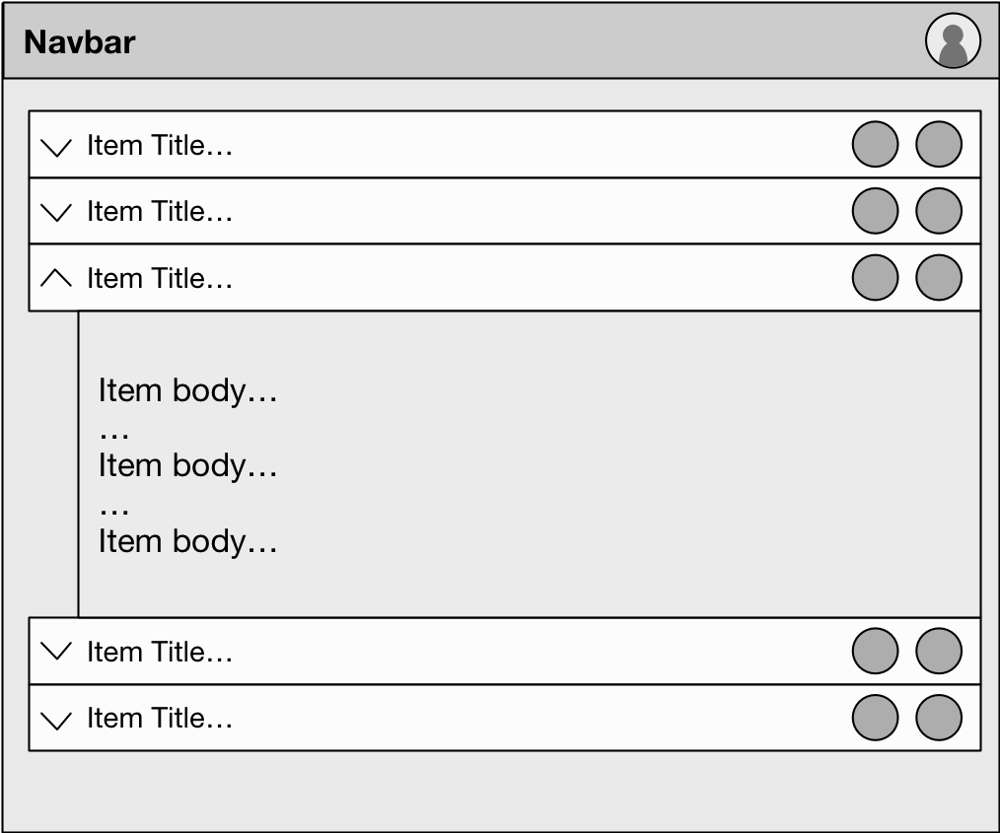

# Casium — An architecture for single-page applications

Casium is a front-end architecture that you can use with virtual DOM libraries like React or Vue.

It is a _data_ and _effects_ management system that helps you manage the complexity of large single-page applications in a reliable and predictable way.

It does this by modeling the state of your application (yes, all of it) as a single, immutable value, and handling side-effects in application logic with _messages_. If this reminds you of [Redux](http://redux.js.org/), that might be because both are derived from [The Elm Architecture](https://guide.elm-lang.org/architecture/). However, this library attempts to hew more closely to Elm's design in order to gain [more of Elm's advantages](https://www.youtube.com/watch?v=XsNk5aOpqUc&t=16m24s), and to provide a better, more cohesive developer experience.


<table>
  <tbody>
  <tr>
  	<td style="padding-top: 20px; border: 0;">
  	<a href="https://www.youtube.com/watch?v=oRZ3eijGTK4" style="text-decoration: none;"><strong>
  		Talk: Casium—Undux Your Front-End
  	</strong><br /></a></td>
  	<td style="border: 0;">
	  	<h3>Contents</h3>
		<ul>
			<li><a href="#how-to-structure-applications">How to structure applications</a></li>
			<li><a href="#messages">Messages</a></li>			<li><a href="#talking-to-the-outside-world">Talking to the outside world</a></li>
			<li><a href="#growing-applications">Growing applications</a></li>
			<li><a href="#extending-commands">Extending commands</a></li>
			<li><a href="#why-immutability-and-managed-effects">
				Why immutability and managed effects?
			</a></li>
			<li><a href="#writing-tests">Writing tests</a></li>
			<li><a href="#testing-commands">Testing commands</a></li>
			<li><a href="#refactoring-with-helper-functions">Refactoring with helper functions</a></li>
			<li><a href="#subscriptions">Subscriptions</a></li>
			<li><a href="#customizing-the-environment">Customizing the environment</a></li>
			<li><a href="#adding-custom-effects">Adding custom effects</a></li>
			<li><a href="#adding-types-with-typescript">Adding types with TypeScript</a></li>
		</ul>
  	</td>
  </tr>
  </tbody>
</table>


## How to structure applications

Applications implemented on Casium are organized into two different types of React components (this example uses React, but we support others, too):

 - **Containers** (or container components), which are implemented using a function exported by Casium: containers manage your application's data model, how it changes, and other application logic
 - **Views** (or view components), which are normal [React stateless functional components](https://www.reactenlightenment.com/react-state/8.4.html): they receive the data model managed by the container, as well as a special function to communicate events back to the container

In other words...

```javascript
class Never extends Component { /* 😉 */ }
```
Because Casium manages application state and lifecycle events for us, we should (almost) never need to implement a class-based React component.

### The counter example

The basic implementation of a container looks like this:

```javascript
import React from 'react';
import { container, Message } from '@casium/react-starter';

class Increment extends Message {}
class Decrement extends Message {}

export default container({

  init: () => ({ count: 0 }),

  update: [
    [Increment, ({ count }) => ({ count: count + 1 })],
    [Decrement, ({ count }) => ({ count: count - 1 })]
  ],

  view: ({ emit, count }) => (
    <div>
     <button onClick={emit(Decrement)}> - </button>
     {count}
     <button onClick={emit(Increment)}> + </button>
    </div>
  )
});
```

Containers are composed primarily of 3 things:

 - **`init`**: A function that returns the container's initial model state. This is called when the container is first instantiated, and should set up the default values for all model values to be used in the container. This should be a plain JavaScript `Object`. (This function will sometimes take a parameter if part of the model is being delegated to it from higher up&mdash;we'll get to that later). In general, other functions you write shouldn't have to check whether values exist. If they do, you should probably update your `init` function.
 - **`update`**: A list of pairs that combine a _message_ with an _update handler_ (or _updater_). This is where the action happens. All changes to the application, whether model changes or side-effects (like HTTP calls, reading and writing cookies, local storage, etc.) happen via _messages_. This allows the entire model and lifecycle of the application to decompose to simple data structures. Containers intercept messages, and call the updater for that message with the current model as a parameter. The updater returns the new model. Finally, the container re-renders the view with the new model.
 - **`view`**: The view is a stateless component that receives the container's current model as its arguments (as well as any other arguments passed to the container by a rendering layer, such as React). In addition to the model, it also receives one special value, **`emit`**, which is a function that accepts a message and gets assigned to an event handler. This is what allows the container to be notified about events that we care about, and respond with the appropriate updater.

## Messages

You may have also noticed the `Increment` and `Decrement` classes up at the top that extend `Message`. As you probably guessed, those are the _messages_ referenced in the explanation above. Messages are a powerful abstraction, but right now we're just using them to link an event handler to an update we want to apply.

### Messages with data

In the initial example, we completed the cycle of...

 1. Setting up the container with an initial model from `init`
 1. Rendering the `view` with the initial model
 1. Receiving messages from the `view`
 1. Handling the messages in `update`
 1. Updating the model with the `Increment` or `Decrement` messages and their respective updaters
 1. Re-rendering the `view`
 1. Go to (3)

It looks a bit like this...


This is a good start, but it's somewhat limiting. What if we need to step the counter by 100, or 1000? That's a lot of clicking. We could create up/down messages & buttons for powers of 10, but that's a lot of boilerplate.

Instead, we can turn the counter display into an `<input />` to allow users to type in arbitrary values, and wire the input up to the container with a new message:

```javascript
class Increment extends Message {}
class Decrement extends Message {}
class SetCounter extends Message {} // <-- New thing

export default container({

  init: () => ({ count: 0 }),

  update: [
    [Increment, ({ count }) => ({ count: count + 1 })],
    [Decrement, ({ count }) => ({ count: count - 1 })],
    [SetCounter, (model, { value }) => ({ count: parseInt(value, 10) })]
  ],

  view: ({ emit, count }) => (
    <div>
      <button onClick={emit(Decrement)}> - </button>

      <input
        type="number"
        value={count}
        onChange={emit(SetCounter)}
      />

      <button onClick={emit(Increment)}> + </button>
    </div>
  )
});
```

We've created a new message, `SetCounter`, to handle our new event.  You'll also notice that the updater for `SetCounter` looks a bit different from the ones before. In addition to being typed objects, messages can hold _data_, either from the view, or from _commands_ (we'll get to that later). In the previous examples, none of the messages used data&mdash;we just took in the existing model, destructured it to the value(s) we cared about, and returned a new model.

Updaters receive message data as their second parameter, and we can likewise [destructure](http://2ality.com/2015/01/es6-destructuring.html) the part we care about, use it to calculate a new model, and return said model.

By default, messages emitted from DOM events will have `value` and/or `checked` properties, which will match the properties of the element emitting the event, for convenience purposes.

### Parameterizing messages

Suppose all that typing is just too much, and we decide we _did_ want buttons to step our counter by larger increments. We can add parameters to our messages directly in the view, and refactor our existing updaters to accomodate them.

First, we'll add _default values_ to our messages:

```javascript
class Increment extends Message {
  static defaults = { step: 1 };
}
class Decrement extends Message {
  static defaults = { step: 1 };
}
```

This means that these messages will always pass a `step` value to their update handlers: either one provided by the view, or the default value of 1. Next, we'll override the default `step` value in the view, by adding a new pair of buttons:

```javascript
export default container({

  // ...

  view: ({ emit, count }) => (
    <div>
      <button onClick={emit([Decrement, { step: 10 }])}> -- </button>
      <button onClick={emit(Decrement)}> - </button>

      <input
        type="number"
        value={count}
        onChange={emit(SetCounter)}
      />

      <button onClick={emit(Increment)}> + </button>
      <button onClick={emit([Increment, { step: 10 }])}> ++ </button>
    </div>
  )
});
```

We can see in the new `++` and `--` buttons that the format for calling `emit()` has changed: instead of just passing a message class, we're now passing an array with a message class and an object with some values. These values will be merged with any other data received from the view when constructing the message.

Finally, we need to close the loop and modify our update handlers to accept the `step` value. As above, updaters receive message data as their second parameter. Since we only care about `step`, we'll destructure it directly:

```javascript
export default container({

  // ...

  update: [
    [Increment, ({ count }, { step }) => ({ count: count + step })],
    [Decrement, ({ count }, { step }) => ( count: count - step })],
    [SetCounter, (model, { value }) => ({ count: parseInt(value, 10) })]
  ],

  // ...
});
```

Now the counter is updating according to `step`, and we can reuse the same message in different contexts by parameterizing it appropriately. Next we'll look at how we can leverage and extend messages to encapsulate business logic and reduce updater boilerplate.

## Talking to the outside world

So far we've looked at managing and rendering data within an application. That's a good start, but in order to do something useful, we need to step outside our cozy, stable world of immutable data and interact with very mutable, unstable things. Things like servers, and browser services like cookies and local storage.

These interactions are called _side-effects_, and side effects trip us up because they break our guarantees about the state of our application. Up till now, we've been able to model the state of our application with a very simple equation: `current = initial + (messages...)` — in other words, each model state is the sum of the one before it, plus the most recent message, going all the way back to the initial model state.

### Lifestyles of the rich and the stateless

Think of it like a bank ledger: the current balance is just a sum of all the transactions. However, when we introduce side-effects, our bank balance starts changing out from under us. We no longer have an audit log of what it should be or why. We have no way to predict it, and we've lost the ability to reproduce it or examine it in an isolated context.

So, how do we make the state predictable again? With more messages, of course!

Up until now, we've been both producing (in the view) and consuming (in the update) our own messages. _Command messages_ (or just _commands_) are a new type of message: we produce them, but they're consumed by Casium, in the background, away from our application code. Casium _manages_ our effects for us. We use these commands any time we want to read, write, or execute something outside of our model, like HTTP calls, cookies, etc.

As with model changes, commands are returned by update handlers. This allows update handlers to be [pure, stateless, side-effect-free functions](https://softwareengineering.stackexchange.com/questions/254304/what-is-referential-transparency): they always return the same value for the given inputs.

Further, they don't actually _do_ things: the simply return values that _represent_ doing things. Let's test-drive this by implementing a button to save the counter to local storage. We'll start by importing the necessary commands. Casium comes pre-packaged with commands for most common operations.

We can import and use these commands to tell Casium what effects we want, and Casium will handle them for us:

```javascript
import { Storage } from '@casium/react-starter/commands';
```

This imports a module object with a few different classes for our consumption.

Next, we'll implement a button to trigger our save, with a new `SaveCounter` message, and add a placeholder update handler where we'll eventually put our new command:

```javascript
// ...
class SaveCounter extends Message {}

export default container({
  // ...

  update: [
    // ...
    [SaveCounter, (model) => [model]]
  ],

  view: ({ emit, count }) => (
    <div>
      // ...
      <button onClick={emit(SaveCounter)}>Save</button>
    </div>
  )
})
```

This doesn't do anything yet (except render a new button), but we can already see that something with the update handler is a little different: we're still returning the model, but now it's inside an array. This gives us a place to put our commands, since we'll be returning two things instead of one. Let's add that second thing now:

```javascript
// ...
export default container({
  // ...

  update: [
    // ...
    [SaveCounter, (model) => [model, new Storage.Write({
      key: 'counter',
      value: model.count
    })]]
  ],

  // ...
})
```

Here, we're returning a new instance of the `Storage.Write` command message, and giving it a `key` and a `value`, which tells local storage what to write.

This is all well and good for fire-and-forget operations like writing to local storage, but what about _reading_? What about commands that do things where we care about the result?

We handle this by giving the command a _result message_. These are normal messages that we implement and handle ourselves, just like the ones emitted from the view. We pass one of these messages to the command in a `result` key, and Casium will send that message back to the container when the command has executed.

This extends the cycle of our data flow like so:


In addition to the primary cycle of messages and model changes (and rendering, etc.), we now have a secondary cycle where updaters _also_ return commands (in addition to updating the model), which send messages back to an updater.

This style might feel weird if you're used to using promises or callbacks. Promises and callbacks make it easy to do long chains of deeply-nested behaviors, that can be tough to decompose when debugging, testing, or refactoring.

This approach lets us flatten out those chains, letting us handle one logical update at a time, in isolation from others.

Let's try loading the counter back from local storage when the container initializes. Because we don't want to break the isolation boundary by touching local storage directly, we'll have `init()` kick off a command that will be immediately handled and returned to the container in the form a `result` message, which we'll define below as `LoadCounter`.

The expected return value format for the `init()` function is actually the same as for update handlers, so we can implement this just by changing what it returns:

```javascript
// ...
class LoadCounter extends Message {}

export default container({

  init: () => [{ count: 0 }, new Storage.Read({
    key: 'counter',
    result: LoadCounter
  })],

  update: [
    [LoadCounter, (model, { value }) => ({ count: value })],
    // ...
  ],

  // ...
})
```

**Sidebar: Updater Return Formats ⬇**

> Updaters support a number of different return formats to enable different programming patterns:
>  - **Just the model**: Returning an object will replace the current model with that object
>  - **A model and a command**: As in `init` above, a 2-element array (or _tuple_) is used to update the model _and_ run a command
>  - **A model and multiple commands**: The above pattern can be extended to run multiple commands, just keep appending commands to the array
>  - **A model and multiple commands, part deux**: Sometimes it's easier to put commands together in their own array&mdash;return a tuple where the first element is the model and the second is an array of any number of commands
>  - **Update-ception**: Finally, in addition to the forms above, an updater function can return _another_ updater function... which can return another updater function (and so on)&mdash;the functions will continue to be called until one of the above formats is returned; this is useful for advanced function composition techniques, and pairs nicely with Casium's built-in helper functions which you'll learn about in a later section

Again, we're changing the return value of `init()` to the array format we saw before, so that we have a way to return both the initial model _and_ the command. We construct a `Read` message with the `key` we want to read, and `result`, which is the message that will be sent back to the container with, you guessed it: the result. This is symmetrical to the `Write` command, except that the `key` and the `value` are spread across the command and result message, respectively.

We handle our `LoadCounter` message, destructuring the `value` property and assigning it to the `count` property of the new model. Great, right?

Well, almost. Don't look now, but we've just introduced an error into our app: `count` is supposed to be a number, but local storage returns strings. We need to pass `value` through `parseInt()` and... this is starting to look a lot like work we've already done.

Instead, we can reuse the existing `SetCounter` message — both messages expect to have a `value` which gets number-ified and written to the `count` property of the model.

Altogether, the app should look something like this:

```javascript
import React from 'react';
import { container, Message } from '@casium/react-starter';
import { Storage } from '@casium/react-starter/commands';

class Increment extends Message { static defaults = { step: 1 } }
class Decrement extends Message { static defaults = { step: 1 } }
class SetCounter extends Message {}

export default container({

  init: () => [{ count: 0 }, new Storage.Read({
    key: 'counter',
    result: SetCounter
  })],

  update: [
    [Increment, ({ count }, { step }) => ({ count: count + step })],
    [Decrement, ({ count }, { step }) => ( count: count - step })],
    [SetCounter, (model, { value }) => ({ count: parseInt(value, 10) })],
    [SaveCounter, (model) => [model, new Storage.Write({
      key: 'counter',
      value: model.count
    })]]
  ],

  view: ({ emit, count }) => (
    <div>
      <button onClick={emit([Decrement, { step: 10 }])}> -- </button>
      <button onClick={emit(Decrement)}> - </button>

      <input
        type="number"
        value={count}
        onChange={emit(SetCounter)}
      />

      <button onClick={emit(Increment)}> + </button>
      <button onClick={emit([Increment, { step: 10 }])}> ++ </button>

      <button onClick={emit(SaveCounter)}>Save</button>
    </div>
  )
});
```

### Conditional command values

In order to avoid unwieldy `if` blocks to return different forms when you only want to run a command _sometimes_, you're able to use `null`, `false` or `undefined` (they're all equivalent) anywhere a command is accepted. Suppose you only wanted to persist the counter for only the most committed of users, let's say when it's over 9000. You could rewrite the above as follows:

```javascript
[SaveCounter, (model) => [
  model,
  model.count > 9000 && new Storage.Write({
    key: 'counter',
    value: model.count
  })
]]
```

Unless `count > 9000`, the overall expression of the second array element evalutes to `false`, and the `Write` command won't get run.

## Growing applications

Let's say you have an application that's structured similar to this diagram. It has top-level navigation with user session management, a list of items, and below each item is an expandable item detail view.



There's quite a bit going on here: navigation, an avatar showing user session state&mdash;there's also the list of items, each with a toggle button for showing or hiding the detail view, as well as some management controls. Finally, there's the item detail view itself, and whatever additional information or UI controls that are required there.

While it's possible to manage the whole application with a single container, it would start to become pretty unwieldy. Instead, we want to be able to split our application into multiple containers, but allow them all to share a single model tree. We do this by using _delegation_.

Delegation allows a container to take a piece of _its_ model and _delegate_ it to a child container. The delegated sub-object of the parent model then becomes the model of the child container, and the child container is able to manage it.

We'll start with a stub application and an initial data model to demonstrate how to break this down:

```javascript
import React from 'react';
import { render } from 'react-dom';
import { container, Message } from '@casium/react-starter';

const initialModel = {
  user: {
    id: 12345,
    name: 'Test User',
    email: 'test@user.com'
  },
  items: [
    {
      id: 1,
      title: 'Item 1',
      details: {
        body: 'This is the first item',
        lastUpdated: new Date(1547322948000)
      }
    },
    {
      id: 2,
      title: 'Item 2',
      details: {
        body: 'This is the middle item',
        lastUpdated: new Date(1547927795000)
      }
    },
    {
      id: 3,
      title: 'Item 3',
      details: {
        body: 'This is the last item',
        lastUpdated: new Date(1548532598000)
      }
    }
  ]
};

const AppContainer = container({
  init: () => initialModel,
  view: () => (<div>Hello world</div>)
});

render(<AppContainer />, document.getElementById('app'));
```

We'll start breaking things out by making a separate module for `AppContainer`'s view component (you can see the full view code in the example app [**@TODO: add link**]), then importing it and assigning it to the container:

```javascript
// ...
import View from './app-view';

// ...

const AppContainer = container({
  init: () => initialData,
  view: View
});
```

**@TODO: Child container**

## Extending commands

Suppose you wanted to implement a sign-in form. It might look something like this:

```javascript
import React from 'react';

import { container, Message, replace } from '@casium/react-starter';
import { Http } from '@casium/react-starter/commands';

class Change extends Message {}
class Submit extends Message {}
class Success extends Message {}
class Failed extends Message {}

export default container({

  init: () => ({ email: '', password: '', message: '' }),

  update: [
    [Submit, model => [model, new Http.Post({
      url: '/api/sign-in',
      data: { email: model.email, password: model.password },
      result: Success,
      error: Failed
    })]],

    [Success, replace({ message: 'Login succeeded' })],

    [Failed, replace({ message: 'Login failed. Check your input & try again' })],

    [Change, (model, { key, value }) => ({ [key]: value, ...model })]
  ],

  view: ({ emit, email, password }) => (
    <form onSubmit={emit(Submit)}>
      {message && <div>Message: {message}</div>}

      <input
        type="email"
        value={email}
        onChange={emit([Change, { key: 'email' }])}
      />

      <input
        type="password"
        value={password}
        onChange={emit([Change, { key: 'password' }])}
      />

      <input type="submit" value="Sign In" />
    </form>
  )
});
```

This looks okay, but let's say our API switches to OAuth for authentication. The login form will have to be updated to submit credentials in an OAuth-compliant way. The `Submit` updater code is about to get really noisy.

One way we can deal with this extra complexity is to extract the logic to build the OAuth token request into a command that _extends_ the built-in `Http.Post` command. Since commands are just regular JavaScript classes, this is pretty trivial:

```javascript
import { Http } from '@casium/react-starter/commands';
import { stringify } from 'querystring';

export default class SignIn extends Http.Post {

  constructor({ email, password, ...values }) {
    super({
      url: '/oauth/token',
      headers: {
        'Content-Type': 'application/x-www-form-urlencoded',
      },
      data: stringify({
        client_id: 'my-app',
        username: email,
        password,
        grant_type: 'password',
      }),
      ...values
    });
  }
}
```

It consumes the application's existing model (i.e. the `email` and `password` fields) and maps them to the values that OAuth expects. This lets us to neatly encapsulate the details of performing OAuth token requests, and allows the rest of the application can remain blissfully ignorant of those details. The constructor also accepts `...values`, which allows us to customize how the request is handled, i.e. with `result` and `error`. Finally, the whole structure is passed up to `Http.Post`'s constructor using `super()`.

Consuming the new command is as simple as swapping `Http.Post` out for the new command (and dropping the `url` field, since it's encapsulated already):

```javascript
import React from 'react';
import { container, Message, replace } from '@casium/react-starter';

// Import the new command
import SignIn from './sign-in';

// ...

export default container({

  update: [
    [Submit, model => [model, new SignIn({
      data: { email: model.email, password: model.password },
      result: Success,
      error: Failed
    })]],

    // ...
  ],

  // ...
});
```

## Why immutability and managed effects?

As we talked about, all changes in the application are handled by _messages_. Messages are either emitted from the view, or the result of a _command message_ (or just _command_).

**@TODO**

## Writing tests

Here's what an example unit test for the first draft of our counter container might look like. Note that we're not making any assertions about the view, just the updates and the container's model.

```javascript
import { isolate } from '@casium/react-starter';
import CounterContainer, { Increment, Decrement } from './';

describe('CounterContainer', () => {
  const container = isolate(CounterContainer);

  beforeEach(() => container.push({ count: 0 }))

  describe('model changes', () => {

    it('should increment', () => {
      container.dispatch(new Increment());
      expect(container.state()).to.deep.equal({ count: 1 });
    });

    it('should decrement', () => {
      container.dispatch(new Decrement());
      expect(container.state()).to.deep.equal({ count: -1 });
    });
  });
});
```

## Testing commands

**@TODO**

```javascript
describe('CounterContainer', () => {
  // ...

  describe('local storage handling', () => {

    it('should save counter', () => {
      container.push({ count: 1138 });
      const cmds = container.dispatch(new SaveCounter());

      expect(cmds).to.deep.equal([
        new Storage.Write({ key: 'counter', value: 1138 })
      ]);
    });
  });
});
```
## Refactoring with helper functions

**@TODO**

## Subscriptions

**@TODO**

## Customizing the environment

Up to this point, we've been using the `container()` function provided by `@casium/react-starter`, which includes everything you need to get started building an application with Casium. However, it may include things you _don't_ need, which means having to ship a larger JavaScript bundle than necessary when going to production.

The functionality provided by the default `container()` function comes from the _environment_. An environment is bound to a container and provides the implementation details for all the side effects that Casium handles for you, including running commands, changing the model, and logging errors to the console. It also manages how Casium integrates with host rendering tools, like React.

In fact, the `container()` function we've been using so far is actually just a partially-applied version of the `withEnvironment()` function from `@casium/core`, which accepts an environment as its first parameter and a container definition as its second. You can use this function to create your own `container()` function that's tailored to your application.

For example, if we wanted to create a new React application that talked to the browser's local storage and an HTTP API, we'd start by installing the following packages (in addition to `react` and `react-dom`):

```bash
# ...or `npm install`, if that's more your thing
yarn add @casium/core @casium/react @casium/http @casium/storage
```

Next, we wire our chosen packages together into a custom `container()` function:

```javascript
import { environment, mergeMaps, withEnvironment } from '@casium/core';
import { renderer } from '@casium/react';

import Http from '@casium/http';
import Storage from '@casium/storage';

export const container = withEnvironment(environment({
  effects: mergeMaps([Http, Storage]),
  renderer
}));
```

With those few short lines of code, we've fully migrated away from our dependence on `react-starter` and into a tight, form-fitting bundle based on just what our application needs.

## Adding custom effects

**@TODO**

## Adding types with TypeScript

**@TODO**

# Development

## Getting Started

```
yarn
yarn test
```
